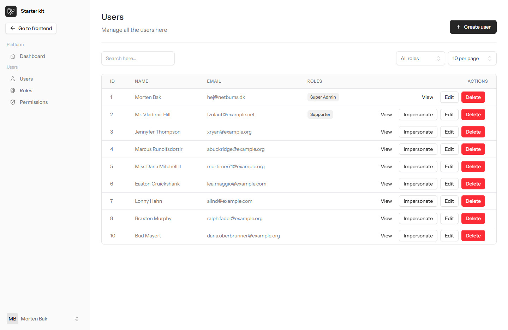
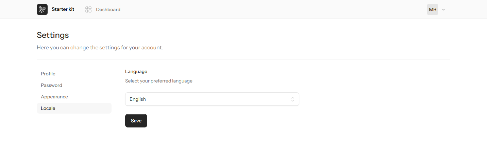

includes features:
- ✅ **User Management**, 
- ✅ **Role Management**,
- ✅ **Permissions Management**,
- ✅ **Localization** options
- ✅ Separate **Dashboard for Super Admins**
- ✅ Updated for Laravel 12.0 **and** Livewire 3.0

### Admin dashboard view:

### Supporting multiple languages:

## TALL stack
It uses the TALL stack, which stands for:
-   [Tailwind CSS](https://tailwindcss.com)
-   [Alpine.js](https://alpinejs.dev)
-   [Laravel](https://laravel.com)
-   [Laravel Livewire](https://livewire.laravel.com) using the components.

## Further it includes:
Among other things, it also includes:
-   [Flux UI](https://fluxui.dev) for flexible UI components (free version)
-   [Laravel Pint](https://github.com/laravel/pint) for code style fixes
-   [PestPHP](https://pestphp.com) for testing
-   [missing-livewire-assertions](https://github.com/christophrumpel/missing-livewire-assertions) for extra testing of Livewire components by [Christoph Rumpel](https://github.com/christophrumpel)
-   [LivewireAlerts](https://github.com/jantinnerezo/livewire-alert) for SweetAlerts
-   [Spatie Roles & Permissions](https://spatie.be/docs/laravel-permission/v5/introduction) for user roles and permissions
-   [Strict Eloquent Models](https://planetscale.com/blog/laravels-safety-mechanisms) for safety
-   [Laravel Debugbar](https://github.com/barryvdh/laravel-debugbar) for debugging
-   [Laravel IDE helper](https://github.com/barryvdh/laravel-ide-helper) for IDE support

## Upcoming features
I'm considering adding the following features, depending on my clients' most common requirements:
-   [Wire Elements / Modals](https://github.com/wire-elements/modal) for modals (still deciding - for now I'm using Flux UI for this)
-   [Laravel Cashier](https://laravel.com/docs/10.x/billing) for Stripe integration
